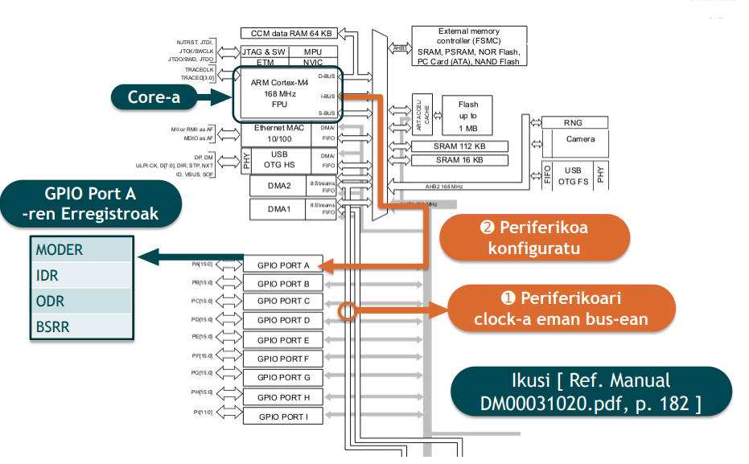

# 1. Aurkibidea

<!-- TOC -->
- [1. Aurkibidea](#1-aurkibidea)
- [2. Mikrokontrolagailua](#2-mikrokontrolagailua)
    - [2.1. Erreferentziak](#21-erreferentziak)
- [3. Periferikoak](#3-periferikoak)
    - [3.1. Periferikoen konfigurazioa](#31-periferikoen-konfigurazioa)
        - [3.1.1. Erakusle edo puntero bidez:](#311-erakusle-edo-puntero-bidez)
- [4. GPIO](#4-gpio)
    - [4.1. Erregistroak](#41-erregistroak)
    - [4.2. Clock-a](#42-clock-a)
    - [4.3. Funtzio Alternatiboak](#43-funtzio-alternatiboak)
    - [4.4. GPIO APIak](#44-gpio-apiak)
        - [4.4.1. RCC busa aktibatu](#441-rcc-busa-aktibatu)
        - [4.4.2. GPIO erregistroa konfiguratu](#442-gpio-erregistroa-konfiguratu)
        - [4.4.3. GPIO Piztu / Itzali](#443-gpio-piztu--itzali)
        - [4.4.4. GPIO Irakurri](#444-gpio-irakurri)
- [5. TIMERak](#5-timerak)
    - [5.1. Prescaler](#51-prescaler)
    - [5.2. Counter](#52-counter)
    - [5.3. Auto Reload](#53-auto-reload)
    - [5.4. PLL](#54-pll)
        - [5.4.1. Konparaketa](#541-konparaketa)
    - [5.5. Clock sistema](#55-clock-sistema)
    - [5.6. HSI eta HSE](#56-hsi-eta-hse)
        - [5.6.1. STM32F303RET6](#561-stm32f303ret6)
    - [5.7. Systick Timer-a](#57-systick-timer-a)
    - [5.8. TIMER APIak](#58-timer-apiak)
        - [5.8.1. RCC busa](#581-rcc-busa)
        - [5.8.2. Frekuentzia](#582-frekuentzia)
        - [5.8.3. Periodoa](#583-periodoa)
        - [5.8.4. TIMERaren direkzioa](#584-timeraren-direkzioa)
        - [5.8.5. TIMERa hasi eta gelditu](#585-timera-hasi-eta-gelditu)
        - [5.8.6. TIMER hasieraketa adibide batzuk:](#586-timer-hasieraketa-adibide-batzuk)
- [6. Etendurak](#6-etendurak)
    - [6.1. Polling vs Etendurak](#61-polling-vs-etendurak)
    - [6.2. Erregistroen balio zaharrak](#62-erregistroen-balio-zaharrak)
    - [6.3. IRQ](#63-irq)
    - [6.4. NVIC-a eta etendura maneiatzailea](#64-nvic-a-eta-etendura-maneiatzailea)
        - [6.4.1. Erabileran kontuan izatekoak](#641-erabileran-kontuan-izatekoak)
        - [6.4.2. Lehentasunak](#642-lehentasunak)
            - [6.4.2.1. Set-Enable](#6421-set-enable)
            - [6.4.2.2. Clear enable](#6422-clear-enable)
        - [6.4.3. TIMER baten adibidea](#643-timer-baten-adibidea)
    - [6.5. APIak](#65-apiak)
        - [6.5.1. TIMER etendura](#651-timer-etendura)
- [7. PWM](#7-pwm)
    - [7.1. Oinarrizko konfigurazioak](#71-oinarrizko-konfigurazioak)
    - [7.2. PWM modura jarri](#72-pwm-modura-jarri)
    - [7.3. Irteera aktibatu x kanalarentzako](#73-irteera-aktibatu-x-kanalarentzako)
    - [7.4. ARR preload](#74-arr-preload)
    - [7.5. Force update to load settings](#75-force-update-to-load-settings)
    - [7.6. Kontagailua aktibatu](#76-kontagailua-aktibatu)
    - [7.7. Erabilera adibidea](#77-erabilera-adibidea)
    - [7.8. GPIO alternate function](#78-gpio-alternate-function)
        - [7.8.1. AFR](#781-afr)
            - [7.8.1.1. AFRL (Alternate Function Low Register) Pin Function Selection](#7811-afrl-alternate-function-low-register-pin-function-selection)
                - [7.8.1.1.1. Explanation:n**:](#78111-explanationn)
        - [7.8.2. Example of Alternate Function Usage:e**:](#782-example-of-alternate-function-usagee)
- [8. C programazioa](#8-c-programazioa)
    - [8.1. Aldagaia uneoro RAMean idatzi / irakurri](#81-aldagaia-uneoro-ramean-idatzi--irakurri)
    - [8.2. Punteroak](#82-punteroak)
    - [8.3. Shifter-a](#83-shifter-a)
    - [8.4. struct-a](#84-struct-a)
- [9. Konpilatzailea](#9-konpilatzailea)
    - [9.1. Konpilatzailearen optimizazio ezarpenak](#91-konpilatzailearen-optimizazio-ezarpenak)
<!-- /TOC -->


# 2. Mikrokontrolagailua


## 2.1. Erreferentziak

Mikrokontrolagailua: `STM32F429`

CPU: ARM Cortex M4 \
FPU: Badauka \
Flash: 2MB

# 3. Periferikoak

## 3.1. Periferikoen konfigurazioa

### 3.1.1. Erakusle edo puntero bidez:

```c
uint32_t    *p = 0xF412A987;// Erregistro helbidea
            *p = 0x4A76;    // Konfigurazio balioa
```

C-n, warning edota errorerik ez emateko, beharrezkoa
da casting bat egitea:
```c
uint32_t    *p = (uint32_t*) 0xF412A987;    // Erregistro helbidea
            *p = 0x4A76;                    // Konfigurazio balioa
```

egiteko beste modu batzuk:

a. Zatikatuta
```c 
volatile uint32_t   *p =(volatile uint32_t*)0xF412A987;
                    *p= 0x4A76;
```

b. zuzenean idatzita
```c 
(*((uint32_t*) 0xF412A987))=0x4A76;
```

c. `#include` bitartez

erregistroak.h
```c 
#define REG_STATUS (*((volatile uint32_t*) 0xF412A987))
```

main.c
```c
#include "erregistroak.h"
REG_STATUS = 0x4A76;
```

d. Helbide + offset

Adib.Periferikoa 0x10000000-n eta erregistroak offset = 10, 20, 30 ...
```c
//Funtzio bat punteroa kalkulatzeko
uint32_t* reg(uint32_t periphbase,uint32_t regOffset) {
return ((uint32_t*)(gpioBase+regOffset));
}
//Laburdura bat REG (a,b) -> *gpio_reg(a,b) idazteko (aukerakoa)
#define REG(BASE,OFFSET) (*(gpio_reg(BASE,OFFSET)))
//Helbideak eta offset-ak
#define GPIOA 0x100000
#define ODR 10
#define IDR 20
#define MODER 30


int main(void) {
REG (GPIOA, ODR)=5;
uint32_t input = REG (GPIOA,IDR);
}
```

e. Struct erabiliz

```c
//Funtzio bat punteroa kalkulatzeko
typedef struct
{
volatile uint32_t MODER;
volatile uint32_t PUPDR;
volatile uint16_t IDR;
volatile uint16_t ODR;
} GPIO_TypeDef;//Helbideak eta offset-ak
#define GPIOA ((GPIO_TypeDef *) 0x1000000)


int main(void) {
GPIOA->IDR=5;
}
```


# 4. GPIO

## 4.1. Erregistroak

Erabilerarako 4 erregistro:
    GPIOx_IDR: Sarrerak
    GPIOx_ODR: Irteerak
    GPIOx_BSRR: Irteerak set/reset bidez
    GPIOx_PUPDR: Pull-up / Pull-down konfigurazioa

Non x = A, B, C ... GPIO portu desberdinak diren (helbide desberdinak)

Gaur egungo µC-tan:
* Periferikoak pinetan multiplexatuak daude: pin bakoitzak funtzio alternatibo bat bainio gehiago


## 4.2. Clock-a

* Periferikoei bus-ean banan-banan clock-a kentzea eta kontsumo baxuagoan sartzea posible da (defektuz horrela daude)

Gaur egungo µC-tan, periferiko bat erabili aurretik:
➊ Periferikoari clock-a eman
➋ Pin-aren funtzio zuzena aukeratu
➌ Periferikoa konfiguratu



## 4.3. Funtzio Alternatiboak

Multiplexatutako funtzio alternatiboen artean hautatzeko:
* STM32-an , multiplexatzailea GPIO-en parte da
* GPIOx_AFRL eta GPIOx_AFRH erregistro bitartez konfiguratzen da


## 4.4. GPIO APIak

Adibide gisa, GPIOB 13 pina hasieratuko da sarrera digital bezala

### 4.4.1. RCC busa aktibatu

Behar den busa hautatu, periferiko bakoitzari dagokiona.

Eman beharreko urratsak:
1. Aktibatu nahi den periferikoaren busa identifikatu (Kasu honetan, GPIOx periferikoak) 
2. RCC busa aktibatzeko erregistroa identifikatu erreferentzia manualean. 
3. Periferikoari dagokion bit-a aktibatu


rcc.h
```c
#ifndef INC_RCC_H_
#define INC_RCC_H_

#define RCC_AHB_GPIOA_BIT_ZBK	17
#define RCC_AHB_ADC12_BIT_ZBK	28

#define RCC_APB1_DAC1_BIT_ZBK	29

void rccHasieratu(void);
void rccAHBENRHasieratu(uint8_t periferikoa);
void rccAPB1ENRHasieratu(uint8_t periferikoa);

#endif /* INC_RCC_H_ */
```

rcc.c 

funtzioak
```c
/**
 * @brief	AHB busaren RCC erregistroak hasieratzen ditu.
 *
 * @param 	periferikoa: hasieratu nahi den periferikoaren bit zenbakia.
 *				stm32f303ret6
 *					AHBENR
 *						0: 	DMA1
 *						1: 	DMA2
 *						2: 	SRAM
 *						4: 	FLITF
 *						5: 	FMC
 *						6: 	CRC
 *						16: GPIOH
 *						17:	GPIOA
 *						18:	GPIOB
 *						19:	GPIOC
 *						20:	GPIOD
 *						21: GPIOE
 *						22:	GPIOF
 *						23: GPIOG
 *						24:	TSC
 *						28: ADC12
 *						29: ADC34
 *
 * @retval 	Ezer ez
 */
void rccAHBENRHasieratu(uint8_t periferikoa)
{
	RCC->AHBENR |= 1<<periferikoa;
}


/**
 * @brief	APB1 busaren RCC erregistroak hasieratzen ditu
 *
 * @param 	periferikoa: hasieratu nahi den periferikoaren bit zenbakia.
 *				stm32f303ret6
 *					AHBENR
 *						0: 	TIM2
 *						1: 	TIM3
 *						2: 	TIM4
 *						4: 	TIM6
 *						5: 	TIM7
 *						11: WWD
 *						14: SPI2
 *						15:	SPI3
 *						17: USART2
 *						18:	USART3
 *						19:	UART4
 *						20:	UART5
 *						21: I2C1
 *						22:	I2C2
 *						23: USB
 *						25:	CAN
 *						26: DAC2
 *						28: PWR
 *						29: DAC1
 *						30: I2C3
 *
 * @retval 	Ezer ez
 */
void rccAPB1ENRHasieratu(uint8_t periferikoa)
{
	RCC->APB1ENR |= 1<<periferikoa;
}
```

erabilera
```c
#include <sistema.h>
#include <rcc.h>


/**
 * @brief	RCC erregistroak hasieratu.
 *
 * @param	Ezer ez
 *
 * @retval	Ezer ez
 */
void rccHasieratu(void)
{
	/* -- AHB -- */

	// GPIOA
	rccAHBENRHasieratu(RCC_AHB_GPIOA_BIT_ZBK);

	// ADC12
	rccAHBENRHasieratu(RCC_AHB_ADC12_BIT_ZBK);

	/* -- APB1 -- */

	// DAC1
	rccAPB1ENRHasieratu(RCC_APB1_DAC1_BIT_ZBK);
}
```

### 4.4.2. GPIO erregistroa konfiguratu

RCC aktibatu ostean, GPIO periferikoa konfiguratu behar da:

gpio.h
```c
#ifndef INC_GPIO_H_
#define INC_GPIO_H_

#define GPIO_INPUT_MODE 				0
#define GPIO_OUTPUT_MODE 				1
#define GPIO_ALTERNATE_FUNCTION_MODE	2
#define GPIO_ANALOG_MODE 				3

void gpioHasieratu(void);
void gpioHasieratuModer(GPIO_TypeDef * GPIOx, uint8_t pin_zbk, uint8_t pin_mota);
void gpioPiztu(GPIO_TypeDef * GPIOx, uint8_t pin_zbk);
void gpioItzali(GPIO_TypeDef * GPIOx, uint8_t pin_zbk);
uint8_t gpioIrakurri(GPIO_TypeDef * GPIOx, uint8_t pin_zbk);

#endif /* INC_GPIO_H_ */
```

konfigurazioa
```c
/**
 * @brief	GPIO erregistroak hasieratu.
 *
 * @param	Ezer ez
 *
 * @retval	Ezer ez
 */
void gpioHasieratu(void)
{
	/* -- SARRERAK -- */

	// Analogikoak
	gpioHasieratuModer(GPIOA, 0, GPIO_ANALOG_MODE);

	/* -- IRTEERAK -- */

	// Analogikoak
	gpioHasieratuModer(GPIOA, 4, GPIO_ANALOG_MODE);
}


/**
 * @brief 	GPIO Moder erregistroak hasieratu.
 *
 * @param	GPIOx: GPIO estruktura
 * @param	pin_zbk: pin zenbakia (0-15)
 * @param	pin_mota: pin mota
 * 				0: Input
 * 				1: Output
 * 				2: Alternate function
 * 				3: Analog
 *
 * @retval	Ezer ez
 */
void gpioHasieratuModer(GPIO_TypeDef * GPIOx, uint8_t pin_zbk, uint8_t pin_mota)
{
	uint8_t moder_bit_zbk = pin_zbk * 2;

	GPIOx->MODER &= ~(3<<(moder_bit_zbk));
	GPIOx->MODER |= pin_mota<<(moder_bit_zbk);

}
```

### 4.4.3. GPIO Piztu / Itzali

Piztu
```c
/**
 * @brief 	GPIO irteera piztu.
 *
 * @param	GPIOx: GPIO estruktura
 * @param	pin_zbk: pin zenbakia (0..15)
 *
 * @retval	Ezer ez
 */
void gpioPiztu(GPIO_TypeDef * GPIOx, uint8_t pin_zbk)
{
	// Irteerari balioa eman
	GPIOx->ODR 	|= 1<<pin_zbk;

}
```

Itzali
```c
/**
 * @brief 	GPIO irteera itzali.
 *
 * @param	GPIOx: GPIO estruktura
 * @param	pin_zbk: pin zenbakia (0..15)
 *
 * @retval	Ezer ez
 */
void gpioItzali(GPIO_TypeDef * GPIOx, uint8_t pin_zbk)
{

	// Irteerari balioa eman
	GPIOx->ODR 	&= ~(1<<pin_zbk);

}
```

### 4.4.4. GPIO Irakurri

Irakurri
```c
/**
 * @brief 	GPIO sarrera irakurri.
 *
 * @param	GPIOx: GPIO estruktura
 * @param	pin_zbk: pin zenbakia (0..15)
 *
 * @retval	egoera: pin-aren egoera
 * 				0: OFF
 * 				1: ON
 */
uint8_t gpioIrakurri(GPIO_TypeDef * GPIOx, uint8_t pin_zbk)
{
	uint8_t egoera = 0;

	egoera = ((GPIOx->IDR >> pin_zbk) & 1);

	return egoera;

}
```


# 5. TIMERak

* PSC: Prescaler
* CNT: Counter
* ARR: Auto Reload


## 5.1. Prescaler

Frekuentzia zatitzailea, frekuentzia handi bat txikiago batean bilakatu, kontagailuak erabiliz.

Jarri nahi den zatitzailea beti -1


## 5.2. Counter

Frekuentzia zatitzaileak emandako pultsuak (flankoak) kontatzen ditu.


## 5.3. Auto Reload

Counterra balio jakin batera iristean, 0re berrabiaraziko du.

Jarri nahi den muga beti -1


## 5.4. PLL


Kristala: 
* Oso zehatza da, baina frekuentzia baxua du.

VCO: 
* Ez dira egonkorrak. 
* Sartutako tentsioaren arabera frekuentzia bat edo bestea emango du.

### 5.4.1. Konparaketa

* Kristala eta VCO konparatuz, ea ondo dabilen edo ez zihurtatzen da.
* Bien arteko errorea integratuz, VCO-ri sarrera tentsio bat sartuko zaio, errorearen arabera frekuentzia igo edo jeitsiz.


## 5.5. Clock sistema


## 5.6. HSI eta HSE

* HSI: Oszilatzaile internoa (RC zirkuitua)
* HSE: Oszilatzaile Externoa (kristala)

Hauen funtzionamendua edo multiplexazioa "clock tree" irudian ikus daiteke (reference manual).

### 5.6.1. STM32F303RET6

* HSI: 8 MHz

## 5.7. Systick Timer-a

Beheraka kontatzen duen 24 bit-eko timer-a, Cortex M-tan


Erabilerarako 3 erregistro:
* `STK_VAL`: Kontagailuaren balioa
* `STK_LOAD`: Kontagailua 0-ra iristean kargatzeko balioa
* `STK_CTRL`: Timer-a konfiguratu eta kontrolatu

CMSIS API-an: Systick->VAL, Systick->LOAD eta Systick->CTRL

## 5.8. TIMER APIak

API hauek agian ezingo dira TIMER gueztietan erabili, reference manuala ikusi beharko litzateke erregistroak zihurtatzeko.

### 5.8.1. RCC busa

Hemen, GPIOetan bezala egin behar da ([RCC GPIO periferikoetan](#411-rcc-busa-aktibatu)).


### 5.8.2. Frekuentzia

Timerrari frekuentzia ezarri, [PSC](#51-prescaler) eta [ARR](#53-auto-reload) konfiguratuz.

```c
/**
 * @brief	Set TIMx frequency.
 *
 * @param	TIMx: TIMx peripheral (e.g. TIM1, TIM2, etc.)
 * @param	frequency: frequency [Hz] (1Hz .. 1MHz)
 *
 * @retval 	None
 */
void timFrequency(TIM_TypeDef * TIMx, uint32_t frequency)
{
	// Timer base configuration
	TIMx -> PSC = (HSI_FREQUENCY/PSC_FREQUENCY)-1; // 16MHz / 16 = 1MHz timer clock

	uint32_t ARR_count = 1000000 / frequency;
	TIMx->ARR = ARR_count - 1;
}
```

### 5.8.3. Periodoa

Timerrari periodoa ezarri, [PSC](#51-prescaler) eta [ARR](#53-auto-reload) konfiguratuz.

```c
/**
 * @brief	Set TIMx period.
 *
 * @param	TIMx: TIMx peripheral (e.g. TIM1, TIM2, etc.)
 * @param	period: pulse period [ms]
 *
 * @retval 	None
 */
void timPeriod(TIM_TypeDef * TIMx, uint32_t period)
{
	// Timer base configuration
	TIMx -> PSC = (HSI_FREQUENCY/PSC_FREQUENCY)-1; // 16MHz / 16 = 1MHz timer clock

	uint32_t ARR_count = period * 1000;
	TIMx->ARR = ARR_count - 1;
}
```

### 5.8.4. TIMERaren direkzioa

TIMERak aurreraka (upcounter, ++) edo atzeraka (downcounter, --) kontatuko duen konfiguratu.

```c
/**
 * @brief	TIMx counter direction.
 *
 * @param	TIMx: TIMx peripheral (e.g. TIM1, TIM2, etc.)
 * @param	direction: counter direction.
 *				0: 	Counter used as upcounter
 *				1:	Counter used as downcounter
 *
 * @retval 	None
 */
void timCounterDirection(TIM_TypeDef * TIMx, uint8_t direction)
{
	TIMx->CR1 &= ~(1<<CR1_DIR_BIT);
	TIMx->CR1 |= direction<<CR1_DIR_BIT;
}
```


### 5.8.5. TIMERa hasi eta gelditu

TIMERa hasi edo gelditu, CEN bita modifikatuz:

Hasi:
```c
/**
 * @brief	Start counter.
 *
 * @param	TIMx: TIMx peripheral (e.g. TIM1, TIM2, etc.)
 *
 * @retval 	None
 */
void timStart(TIM_TypeDef * TIMx)
{
	TIMx->CR1 |= 1<<0;
}
```

Gelditu:
```c
/**
 * @brief	Stop counter.
 *
 * @param	TIMx: TIMx peripheral (e.g. TIM1, TIM2, etc.)
 *
 * @retval 	None
 */
void timStop(TIM_TypeDef * TIMx)
{
	TIMx->CR1 &= ~(1<<0);
}
```

### 5.8.6. TIMER hasieraketa adibide batzuk:

Adibide honetan, honako timer hauei konfigurazio edo erabilera hauek eman zaizkie:
* TIM2: PWM pultsuak
* TIM4: ADC periferikoak sarrera irakurtzeko timerra
* TIM5: LED bat "parpadeatu"

Baliteke bertan ageri diren API batzuk dokumentazio honetan ez azaldu izana.

```c
/**
 * @brief 	Initialise TIM registers
 *
 * @param	None
 *
 * @retval	None
 */
void timInit(void)
{
	tim2Init();
	tim4Init();
	tim5Init();

}


/**
 * @brief 	Initialise TIM2 registers, for PWM pulses
 *
 * @param	None
 *
 * @retval	None
 */
void tim2Init(void)
{
	/* -- TIM2 -- */

	// Initialise ADCx RCC registers
	rccAPB1ENRInit(RCC_APB1_TIM2_BIT);

	// Counter process
	timFrequency(TIM2, 1000);
	timDutyCycle(TIM2, 0);

	// Alignment
	timAlign(TIM2, 0);

	// PWM Mode
	timSetPWMMode12(TIM2, 2, PWM_MODE_1);

	// Enable PWM channel
	timEnablePWMChannel(TIM2, 2, 0);

	// Enable PWM main output
	// timEnableMainOutput(TIM2);

	// Start Timer
	timStart(TIM2);

}


/**
 * @brief 	Initialise TIM4 registers, ADC read timer
 *
 * @param	None
 *
 * @retval	None
 */
void tim4Init(void)
{
	/* -- TIM4 -- */

	// Initialise ADCx RCC registers
	rccAPB1ENRInit(RCC_APB1_TIM4_BIT);

	// Start Timer
	timStart(TIM4);

	// Timer frequency
	timFrequency(TIM4, 10);

	// Timer interruption
	timInterrupt(TIM4);

}


/**
 * @brief 	Initialise TIM5 registers, LED blink timer
 *
 * @param	None
 *
 * @retval	None
 */
void tim5Init(void)
{
	/* -- TIM5 -- */

	// Initialise ADCx RCC registers
	rccAPB1ENRInit(RCC_APB1_TIM5_BIT);

	// Start Timer
	timStart(TIM5);

	// Timer period
	timPeriod(TIM5, 300);

	// Timer interruption
	timInterrupt(TIM5);

}
```


# 6. Etendurak

## 6.1. Polling vs Etendurak

Polling: Denbora guztian kontsultak egin.
Etendurak: Une jakin batzuetan bakarrik egin kontsultak.

## 6.2. Erregistroen balio zaharrak

Etendura bat saltatzen denean, programak egiten ari zena bertan behera uzten du eta etenduraren funtzioa exekutatuko du. Horretarako, erregistro hauek auotmatikoki gordetzen ditu, bueltakoan lehengo daturik ez galtzeko:
* R0
* R1
* R2
* R3
* R12
* R14 (LR) -> Link Register (Funtzioa amaitzean nora joan behar duen)
* R15 (PC) -> Program Counter (Programak zein lerro exekutatu behar duen)
* PSR -> Program Status Register (Flag-ak)

Beharra suertatuko balitz, beste erregistroak (R4..R11) software bidez gorde beharko dira.

## 6.3. IRQ 

Interrupt ReQuest: kobrezko haria, CPUari abisua emango dio.

Timer baten kasuan, ARR baliora iristean abixua emango dio. 

GPIO baten kasuan, botoi batean adibidez, sakatzean seinalea emango du.

## 6.4. NVIC-a eta etendura maneiatzailea

Nested Vector Interrupt Controller

IRQk seinalea ematean, zer egin erabakiko du.

### 6.4.1. Erabileran kontuan izatekoak

Etendurak erabiltzeko ezinbestekoa:
* Perfiferikoaren erregistrotan gaitzea
* NVIC-ean gaitzea (`ISER`)
* [Systick](#57-systick-timer-a)-a berezia da, eta ez dago `ISER`-ean gaitu beharrik (periferikoan gaitzearekin nahikoa da).

Etendura ematean:
* Etendura maneiatzailea exekutatuko da. 
* “Pending”seinalea ezabatu behar da periferikotik, etenduratik atera aurretik! (Adib. `TIM7->SR`-n `UIF`)
* “Pending”seinalea ezabatu behar da software bidez, etenduratik atera aurretik! (`ICPR`)

### 6.4.2. Lehentasunak

Normalean ez daude aktibatuak, eskuz aktibatu behar izaten dira (Periferikoak adibidez). Bestalde, seinalea eman behar duenari ere esan egin behar zaio abisua emango duela.

Etendura bakoitzak zenbaki bat eta lehentasun maila bat dauzka lotuta:


Bektore taula hau `startup_stm32f407xx.s` fitxategian bilatu daiteke. 14.1.3 Interrupt and exception vectors apituluan ageri dira. **GARRANTZITSUA!** Position hartu behar da kontuan!

#### 6.4.2.1. Set-Enable

Aktibatzeko bektore honetan, etendurari dagokion bita (lehentasunaren araberakoa) topa daiteke. Bektore hauek 32 bitekoak dira; ondorioz, etendurarui dagokion bektorea bilatzea garrantzitsua da, beste etendurarik ez aktibatzeko.

* `NVIC_ISERx`

#### 6.4.2.2. Clear enable

Desaktibatzeko bektore honetan, etendurari dagokion bita (lehentasunaren araberakoa) topa daiteke. Bektore hauek 32 bitekoak dira; ondorioz, etendurarui dagokion bektorea bilatzea garrantzitsua da, beste etendurarik ez aktibatzeko.

* `NVIC_ICERx`

### 6.4.3. TIMER baten adibidea

Timer:
* TIMx_DIER (Etendura erregistroa)
    * UIE: Aktibazio bit-a

NVIC:
* NVIC_ISER0 - NVIC_ISER7 : Interrupt Set-Enable Registers
    * ISER[0] = 1;
    * 32bit-eko erregistroak
        * ISER[0] : 0 - 31
        * ISER[0] : 32 - 63
        * ISER[0] : 64 - 95
        * ...
    * ISR bakoitzak bere bit-a dauka
        * TIM7 adibidez, 55. bit-a da.
            * Erabilera: 
                ```c
                NVIC -> ISER[55/32] |= 1 << (55%32);
                ```
    * Naiz eta 0 idatzi ez du ezer egingo.
* NVIC_ICER0 - NVIC_ICER7 : Interrupt Clear-Enable Registers
    * `ICER[0] = 1;`
    * Naiz eta 0 idatzi ez du ezer egingo.

## 6.5. APIak

### 6.5.1. TIMER etendura

Etendura aktibatu:
```c
/**
 * @brief	Enable TIMx interruption.
 *
 * @param	TIMx: TIMx peripheral (e.g. TIM1, TIM2, etc.)
 *
 * @retval 	None
 */
void timInterrupt(TIM_TypeDef * TIMx)
{
	// Update interrupt enable
	TIMx->DIER |= 1<<0;

	uint8_t interrupt_pos = 0;
	if(TIMx == TIM2)
	{
		interrupt_pos = 28;
	}
	else if(TIMx == TIM3)
	{
		interrupt_pos = 29;
	}
	else if(TIMx == TIM4)
	{
		interrupt_pos = 30;
	}
	else if(TIMx == TIM5)
	{
		interrupt_pos = 50;
	}

	NVIC->ISER[interrupt_pos/32] |= 1<<(interrupt_pos%32);
}
```

Etendura funtzioak (`IRQHandler`)
```c
/**
 * @brief	TIM4 interruption function.
 *
 * @param	None
 *
 * @retval 	None
 */
void TIM4_IRQHandler(void)
{
	TIM4->SR &= ~(1<<0);
	pressure = pressureRead();
}


/**
 * @brief	TIM5 interruption function.
 *
 * @param	None
 *
 * @retval 	None
 */
void TIM5_IRQHandler(void)
{
	TIM5->SR &= ~(1<<0);
	led_cycle = 1;
}
```


# 7. PWM

## 7.1. Oinarrizko konfigurazioak

ARR: kontadorearen muga.

PSC: prescaler-aren balioa.

## 7.2. PWM modura jarri

CRRx: duty cycle konfiguratu.

CCMRx: Konfigurazioak egin:
    - OCxM = 110 (PWM Mode 1)
    - OCxPE = 1 (preload enable)

## 7.3. Irteera aktibatu x kanalarentzako

CCER: CCxE = 1

## 7.4. ARR preload

CR1: 7. bit-a aktibatu, ARPE = 1


## 7.5. Force update to load settings

EGR: UG (Update Generation) = 1, 
Berriro hasi kontagailua eta erregistroak eguneratu. Kontuan izan kontagailua ere garbitu egiten dela (hala ere, pprescaler-aren proportzioak ez du eraginik). Kontagailua garbitu egiten da zentroarekin lerrokatutako modua aukeratzen bada edo DIR = 0 bada (upcounting), bestela autoload-en balioa behar da (TIMx_ARR) baldin eta DIR = 1 bada (downcounting).

## 7.6. Kontagailua aktibatu

CR1: CEN = 1


## 7.7. Erabilera adibidea

STM32F401RET6:

TIM2_CH2, PB3

```c
void TIM2Konfiguratu(void)
{
    // Timer base configuration
    TIM2 -> ARR = 1000-1; // PWM frequency = 1MHz / 1000 = 1kHz
    TIM2 -> PSC = 16-1; // 84MHz / 84 = 1MHz timer clock

    // PWM Mode 1 on Channel 2
    TIM2->CCR2 = 500;          // 50% duty cycle
    TIM2->CCMR1 &= ~(0xFF00);  // Clear CCMR1[15:8] (CH2 config)
    TIM2->CCMR1 |= (6 << 12);  // OC2M = 110 (PWM Mode 1)
    TIM2->CCMR1 |= (1 << 11);  // OC2PE = 1 (preload enable)

    // Enable output for channel 2
    TIM2->CCER |= TIM_CCER_CC2E;

    // Enable ARR preload
    TIM2->CR1 |= TIM_CR1_ARPE;

    // Force update to load settings
    TIM2->EGR |= TIM_EGR_UG;

    // Enable counter
    TIM2->CR1 |= TIM_CR1_CEN;
}
```

## 7.8. GPIO alternate function

### 7.8.1. AFR

AFRL == AFR[0]; AFRH == AFR[1];

#### 7.8.1.1. AFRL (Alternate Function Low Register) Pin Function Selection

| **Selection (4-bit)** | **AF#**  | **Description**                            |
|-----------------------|----------|--------------------------------------------|
| `0000`                | AF0      | **System Functions** (e.g., MCO, RTC) or **JTAG/SWD** |
| `0001`                | AF1      | **TIM1/TIM2** (PWM, input capture, etc.)    |
| `0010`                | AF2      | **TIM3/TIM4/5** (Timers)                   |
| `0011`                | AF3      | **TIM9/TIM10/TIM11** (Additional timers)    |
| `0100`                | AF4      | **I2C1/I2C2/I2C3** (Inter-Integrated Circuit) |
| `0101`                | AF5      | **SPI1/SPI2** (Serial Peripheral Interface) |
| `0110`                | AF6      | **SPI3**                                   |
| `0111`                | AF7      | **USART1/USART2** (Universal Synchronous Asynchronous Receiver Transmitter) |
| `1000`                | AF8      | **USART6** (Universal Synchronous Asynchronous Receiver Transmitter) |
| `1001`                | AF9      | **I2C2/I2C3** or **CAN** (Controller Area Network) on some MCUs |
| `1010`                | AF10     | **OTG_FS (USB)**                           |
| `1011`                | AF11     | **Reserved** (Can be used for Ethernet in some MCUs) |
| `1100`                | AF12     | **SDIO** (SD Card Interface)               |
| `1101`                | AF13     | **Reserved**                               |
| `1110`                | AF14     | **Reserved**                               |
| `1111`                | AF15     | **JTAG/SWD or Oscillator Functions** (Clock or Debugging) |

##### 7.8.1.1.1. Explanation:n**:
- **AF0**: Reserved for system functions like the **MCO (Microcontroller Clock Output)** or **JTAG/SWD** for debugging.
- **AF1**: Used for **TIM1/TIM2**, which are often used for **PWM**, **input capture**, and **output compare** modes in **timers**.
- **AF2**: Used by **TIM3**, **TIM4**, and **TIM5** — additional timers for PWM, input capture, etc.
- **AF3**: Used by **TIM9**, **TIM10**, and **TIM11**, typically for low-frequency timers.
- **AF4**: Used by **I2C1**, **I2C2**, and **I2C3**, standard **I2C** (Inter-Integrated Circuit) bus communication.
- **AF5**: Used by **SPI1** and **SPI2**, for high-speed **Serial Peripheral Interface** communication.
- **AF6**: Used for **SPI3** — a third SPI peripheral for **serial data communication**.
- **AF7**: Used by **USART1** and **USART2** for **serial communication** (UART).
- **AF8**: Used for **USART6**, another **serial communication interface**.
- **AF9**: Commonly used by **I2C2/I2C3** or **CAN** (Controller Area Network) in some STM32 variants.
- **AF10**: Used for **OTG_FS** (USB Full Speed) interface for **USB communication**.
- **AF11**: Reserved, but used for Ethernet in certain STM32 variants.
- **AF12**: **SDIO** interface for **SD cards**.
- **AF13** and **AF14**: Reserved for future functions or custom uses.
- **AF15**: Used for **JTAG/SWD** debugging functions or external oscillator connections.


### 7.8.2. Example of Alternate Function Usage:e**:
For example, if you want to use **PB3** (Pin 3 on Port B) for **PWM (TIM2_CH2)**, you would select:

```c
GPIOB->AFR[0] |= (0x1 << (3 * 4));  // Select AF1 for PB3 (TIM2_CH2)
```


# 8. C programazioa

## 8.1. Aldagaia uneoro RAMean idatzi / irakurri

```c++
volatile int batuketa = 0;
```

## 8.2. Punteroak

```c
uint32_t* R0 = (uint32_t*)0x20000000;
uint32_t R1 = *R0;
*R0 = 0x06060606; // 0x20000000, 0x20000001, 0x20000002, 0x20000003 aldatzen dira
R0++; // 0x20000004 (helbidea +4) 
*R0++; // 0x20000004 (barruko balioari +1)

int balioak[8]={1,2,7,8,9}
	int k = balioak[2]; // *(balioak + 2)
```

## 8.3. Shifter-a

```c
1<<4; // 0000 1000
```

## 8.4. struct-a

```c
typedef struct
{
    int erreala
    int konplexua
}konplexua;


/* GPIO */
typedef struct
{
    int MODER
    int OTYPER
}GPIO;
```

# 9. Konpilatzailea


## 9.1. Konpilatzailearen optimizazio ezarpenak

project >> properties >> C/C++ Build >> Settings >> MCU/MPU GCC Compiler >> Optimization >> None(-O0)